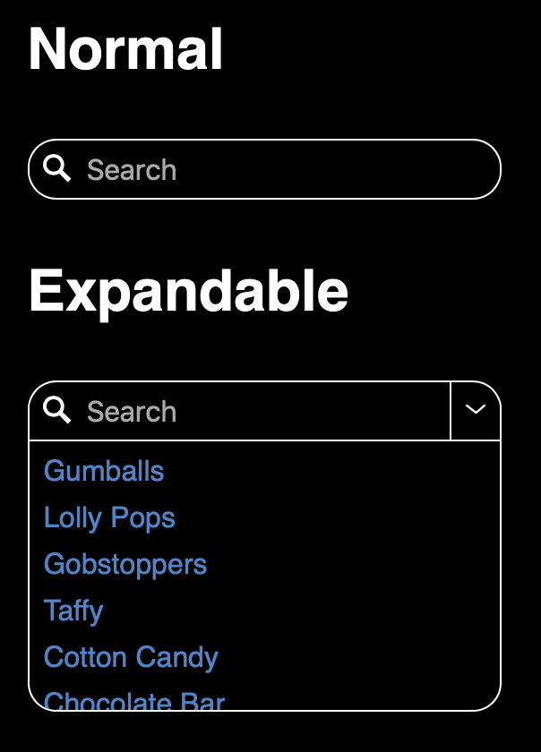

# \<expandable-search-bar>

A Search Bar for searching and also including an expandable Quick Search Menu.



## Installation
```bash
yarn add @internetarchive/expandable-search-bar
```

## Usage
```js
// expandable-search-bar.js
import { ExpandableSearchBar, QuickSearchEntry } from '@internetarchive/expandable-search-bar';
export { ExpandableSearchBar, QuickSearchEntry };
```

```html
<!-- index.html -->
<script type="module">
  import './expandable-search-bar.js';
</script>

<style>
  expandable-search-bar {
    display: block;

    --expandableSearchBarBackgroundColor: black;
    --expandableSearchBarTextColor: white;
    --expandableSearchBarFontSize: 1em;
    --expandableSearchBarBorderColor: 1px solid white;

    --expandableSearchBarMaxExpansionHeight: 150px;
    --expandableSearchBarMinWidth: 5em;

    --quickSearchListPadding: 0 0 0.5em 0;
    --quickSearchListItemPadding: 0.5em 0 0 0;
    --quickSearchLinkColor: rgb(68, 132, 202);
    --quickSearchLinkDecoration: none;
  }
</style>

<expandable-search-bar showsDisclosure='true'>
</expandable-search-bar>

<script>
  // Configure the search bar
  const searchBar = document.querySelector('expandable-search-bar');

  searchBar.addEventListener('inputchange', e => {
    console.log('Input changed', e.detail.value);
  });

  searchBar.addEventListener('enterKeyPressed', e => {
    console.log('Enter key pressed', e.detail.value);
  });

  searchBar.addEventListener('searchCleared', e => {
    console.log('Search cleared');
  });

  searchBar.addEventListener('quickSearchSelected', e => {
    console.log('Quick search selected', e.detail.quickSearchEntry);
  });

  const quickSearch1 = new QuickSearchEntry('Gumballs', { identifier: 'gumballs' });
  const quickSearch2 = new QuickSearchEntry('Lolly Pops', { identifier: 'lollipops' });
  const quickSearch3 = new QuickSearchEntry('Gobstoppers', { identifier: 'gobstoppers' });

  const quickSearches = [quickSearch1, quickSearch2, quickSearch3];

  searchBar.quickSearches = quickSearches;
</script>

```

# Development

## Prerequisite
```bash
yarn install
```

## Start Development Server
```bash
yarn start  // start development server and typescript compiler
```

## Testing
```bash
yarn test
```

## Testing via browserstack
```bash
yarn test:bs
```

## Demoing using storybook
```bash
yarn storybook
```

## Linting
```bash
yarn lint
```
