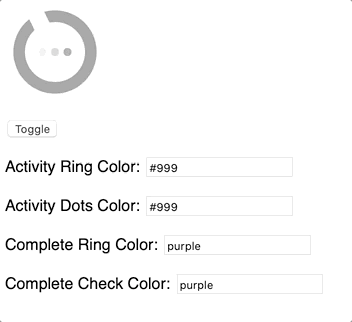

# IA Activity Indicator

A customizable activity indicator.



## Installation
```bash
yarn add @internetarchive/ia-activity-indicator
```

## Usage
```html
<script type="module">
  import '@internetarchive/ia-activity-indicator/ia-activity-indicator';
</script>

<style>
ia-activity-indicator {
  width: 100px;
  height: 100px;
  display: block;
  --activityIndicatorLoadingDotColor: purple;
  --activityIndicatorLoadingRingColor: green;
  --activityIndicatorCheckmarkColor: green;
  --activityIndicatorCompletedRingColor: purple;
}
</style>

<ia-activity-indicator mode="processing"> <!-- or "complete" -->
</ia-activity-indicator>
```

## Linting with ESLint, Prettier, and Types
To scan the project for linting errors, run
```bash
yarn run lint
```

You can lint with ESLint and Prettier individually as well
```bash
yarn run lint:eslint
```
```bash
yarn run lint:prettier
```

To automatically fix many linting errors, run
```bash
yarn run format
```

You can format using ESLint and Prettier individually as well
```bash
yarn run format:eslint
```
```bash
yarn run format:prettier
```

## Testing with Karma
To run the suite of karma tests, run
```bash
yarn run test
```

To run the tests in watch mode (for <abbr title="test driven development">TDD</abbr>, for example), run

```bash
yarn run test:watch
```

## Demoing with Storybook
To run a local instance of Storybook for your component, run
```bash
yarn run storybook
```

To build a production version of Storybook, run
```bash
yarn run storybook:build
```


## Tooling configs

For most of the tools, the configuration is in the `package.json` to reduce the amount of files in your project.

If you customize the configuration a lot, you can consider moving them to individual files.

## Local Demo with `es-dev-server`
```bash
yarn start
```
To run a local development server that serves the basic demo located in `demo/index.html`
