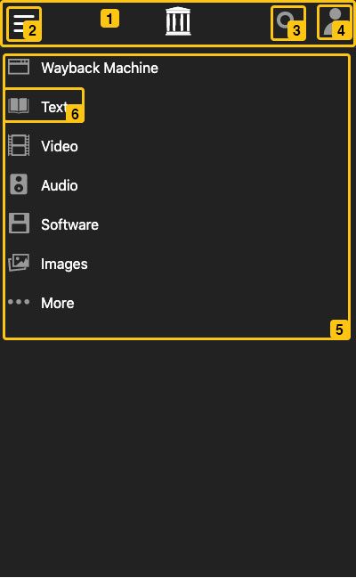
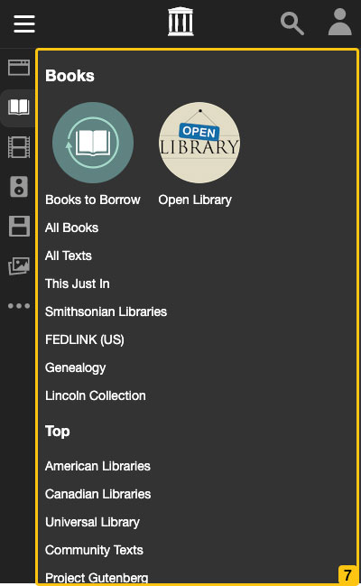
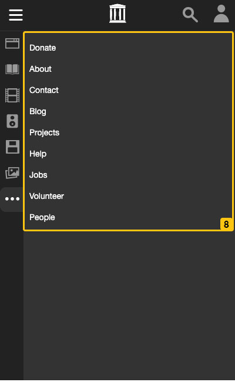
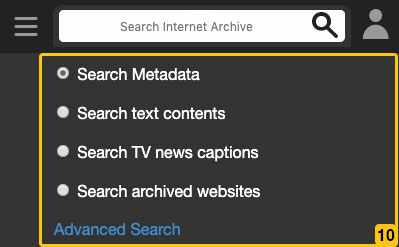
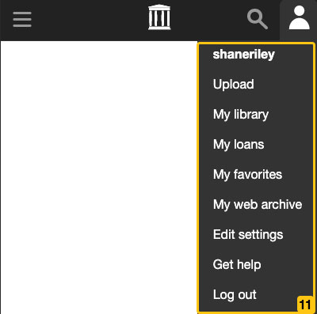

# Component Diagram

1.
    Topnav
    1. _IN_: userMenuOpen, userMenuAnimate, searchMenuOpen, searchMenuAnimate, mediaMenuOpen, mediaMenuAnimate
    1. _OUT_: Hamburger icon, IA logo, search icon, user icon
1.
    Hamburger icon
    1. _IN_: active state
    1. _OUT_: hamburger icon with active class dependent on boolean
1.
    Search icon
    1. _IN_: active state
    1. _OUT_: search icon with active class dependent on boolean
1.
    User icon
    1. _IN_: active state
    1. _OUT_: user icon with active class dependent on boolean
1.
    Media menu
    1. _IN_: mediaMenuOpen, mediaMenuAnimate, mediaSliderOpen, mediaSliderAnimate, selectedMenuOption
    1. _OUT_: Wayback icon and text label, media menu of icons and text labels by media type, ellipses icon and text label for more slider
1.
    Media button
    1. _IN_: icon, href, label, mediatype, selected
    1. _OUT_: Icon and text label for media subnav
1.
    

    Wayback search
    1. _IN_: locationHandler
    1. _OUT_: Wayback search form that redirects to location returned by `locationHandler`
1.
    

    Media slider
    1. _IN_: mediaSliderOpen, mediaSliderAnimate, selectedMenuOption
    1. _OUT_: media subnav component with menu from ID `selectedMenuOption`
1.
    

    More slider
    1. _IN_: none
    1. _OUT_: list of links
1.
    

    Search menu
    1. _IN_: searchMenuOpen, searchMenuAnimate, selectedSearchType
    1. _OUT_: search form with options for filtering
1.
    

    User menu
    1. _IN_: menuItems, username, userMenuOpen, userMenuAnimate
    1. _OUT_: name of currently logged in user and list of links built from `menuItems`
