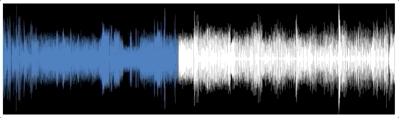
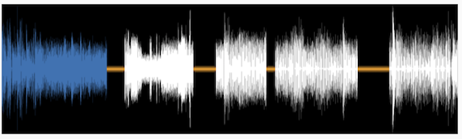
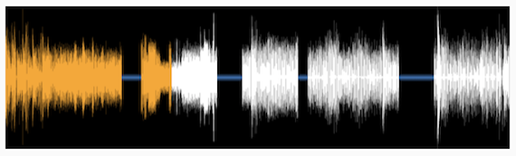

# \<waveform-progress>

A customizable scrubber bar useful for scrubbing through media.



## Zones of Silence



## Customizable Colors



## Installation
```bash
yarn add @internetarchive/waveform-progress
```

## Usage
```js
// waveform-progress.js
import WaveformProgress from '@internetarchive/waveform-progress';
export default WaveformProgress;
```

```html
<!-- index.html -->
<script type="module">
  import './waveform-progress.js';
</script>

<style>
  waveform-progress {
    height: 10rem;
    width: 100%;
    --fillColor: #3272b6;
    --zoneOfSilenceColor: orange;
  }
</style>

<waveform-progress
  id="waveform"
  waveformUrl='./waveform.png'
  interactive=true
></waveform-progress>

<script>
  const waveformProgress = document.getElementById('waveform');

  // set a value
  waveformProgress.percentComplete = 23;

  // add zones of silence if needed
  waveformProgress.zonesOfSilence = [
    { startPercent: 20, endPercent: 23 },
    { startPercent: 52, endPercent: 57 },
    { startPercent: 73, endPercent: 76 }
  ];

  // listen for value changes
  waveformProgress.addEventListener('valuechange', e => {
    console.log('Value has changed, new value:', e.detail.value);
  });
</script>

```

# Development

## Prerequisite
```bash
yarn install
```

## Start Development Server
```bash
yarn start  // start development server and typescript compiler
```

## Testing
```bash
yarn test
```

## Testing via browserstack
```bash
yarn test:bs
```

## Demoing using storybook
```bash
yarn storybook
```

## Linting
```bash
yarn lint
```
